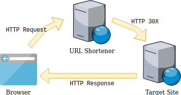
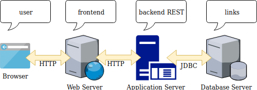

# A simple URL Shortener for Intranet purpose

:fr: [Version française](README_fr.md)

## A- Project introduction

### A.1- The purpose

On company's intranet sites regularly we can see the use of external URL shorteners,
such as those from Google or bit.ly.

It is a very easy and very popular service but **which is not without some problems**
and in particular in an internal company use.

### A.2- What is a URL shortener?

A URL shortener or URL reducer is a short link generator, consisting of assigning a unique key
of few characters to a specific web page with the ability to redirect to the original URL.

The HTTP protocol natively provides the redirection issue by the statuses in the `3XX` range (usually `301`, `302` or `307`).

:information_source: **A shortened link is obviously easier to share or remember.**

Finally, note that many applications, especially social networks, have native integrations (their own reducers).
We can cite YouTube, Facebook, Twitter. LinkedIn, Google.

### A.3- The issues related to URL shorteners

* A reduced URL offered by an Internet service in an internal company use generates useless network flows: we leave the intranet to re-enter it immediately: `intranet -> web proxy -> internet -> firewall -> intranet`
* A reduced URL obscures the original address. The different providers usually offer the possibility of previewing the destination site instead of being redirected directly to it,...  but who really does it?
* There may be as many short links for the same URL as there are shortening services.
* If the external URL reduction service stops then all the reduced addresses using it becomes inaccessible, it is therefore impossible to obtain the original address.
* External URL reduction services take advantage of this to collect data and other statistics.
* A URL can be a sensitive data, it can contain important information in parameters (login, token, even password, ...).
* In the case of internal use, information about the internal infrastructure of the company can be indirectly disclosed.

### A.4- The Facts

It seems that there not a lot of tools on the place that can be installed "on premise" in the network of a company to make this service.

A one is [YOURLS - Your Own URL Shortener](https://github.com/YOURLS/YOURLS) written in PHP.

It is all the aim of this project to be easily deployed (with _Docker_ images) and used in the intranet of a company.

## B- Project description

### B.1- Architecture

Redirection principle:

Components flow:

### B.2- Components

| Component | Purpose | Technologies |
|-----------|---------|--------------|
| Web Frontend | GUI to add/update/delete or display the entries. | Vue.js + Typescript within a NGINX http server |
| Browsers Extensions | Extensions for Web Browsers (Firefox, Chrome) | Javascript |
| Rest API | Expose a REST API to manage the lifecycle of the shortened links and to redirect to the expected targets. | Spring Boot + Liquibase + embedded Tomcat |
| Database | Store the entries. | H2, MySQL, MariaDB, PostGreSQL |

### B.3 - Data model

#### link table

Stores the shortened links.

| Column             | Description | Type           |
|--------------------|-------------|----------------|
| `id`               | Internal ID | `VARCHAR 15`   |
| `target_url`       | Target URL to redirect to | `VARCHAR 255`  |
| `created_by`       | Initial creation user code | `VARCHAR 1024` |
| `creation_date`    | Initial creation  date | `DATETIME`     |
| `last_updated`     | Last updated date | `DATETIME`     |
| `is_private`       | Is link author private ? | `BOOLEAN`      |
| `access_counter`   | Redirection counter | `BIGINT`       |
| `creation_counter` | Creation attempt counter | `BIGINT`       |

#### counter table

Stores the visitor counter of any website you want. 

| Column | Description                | Type           |
|-------|----------------------------|----------------|
| `id` | Internal ID                | `VARCHAR 15`   |
| `url` | Target URL to the website  | `VARCHAR 1024` |
| `created_by` | Initial creation user code | `VARCHAR 255`  |
| `creation_date` | Initial creation  date     | `DATETIME`     |
| `visitor_counter` | Website visitor counter    | `BIGINT`       |

## C- How To

### C.1- Configuring

#### C.1.1- Configuring URL Shortener

The URL shortener behavior can be configured with the following parameters, described below:

| Parameter name | Description | Constraints | Default value |
|----------------|-------------|-------------|---------------|
| `urlshortener.http_redirect_status` | The HTTP status to use for the redirection | Must in range of [300-399] | `301` |
| `urlshortener.id_alphabet` | The alphabet to use for the ID generation | Only single characters separated by comma | `0,...,9,a,...,z,A,...,Z` |
| `urlshortener.id_length` | The length of the generated id | Integer between 2 & 10 | `5` |
| `urlshortener.not_found_page` | The page to use when we redirect to a bad id | An accessible static web page | `static/not_found.html` |

#### C.1.2- Configuring Database

The database used must be a SQL database and is only composed tables named `link` & `count`.
The following JDBC drivers are embedded:

* H2: `com.h2database:h2`
* MySQL: `mysql:mysql-connector-java`
* MariaDB: `org.mariadb.jdbc:mariadb-java-client`
* PostgreSQL: `org.postgresql:postgresql`

Database access can be configured with the following parameters:

| Parameter name | Description | Default value |
|----------------|-------------|---------------|
| `spring.jpa.database` | The database type | :no_entry_sign: |
| `spring.datasource.url` | The database JDBC URL | :no_entry_sign: |
| `spring.datasource.username` | The database username | :no_entry_sign: |
| `spring.datasource.password` | The database user password | :no_entry_sign: |

#### C.1.3- Configuring LDAP

For simplicity's sake security is only based on a LDAP or AD directory, without any role management.

The company directory can be configured with the following settings:

| Parameter name | Description | Sample Value |Default value |
|----------------|-------------|--------------|--------------|
| `spring.ldap.urls` | The directory URL | `ldap://myserver.mycompany:389/` | :no_entry_sign: |
| `spring.ldap.base` | The directory root | `dc=mycompany,dc=org` | :no_entry_sign: |
| `spring.ldap.username` | Username used to connect to the directory | `uid=ldap_reader,ou=people` | :no_entry_sign: |
| `spring.ldap.password` | The user password used to connect to the directory | :no_entry_sign: | :no_entry_sign: |
| `urlshortener.ldap_user_search_filter` | The LDAP search filter to find the users, relative to the root | `(uid={0})` | :no_entry_sign: |

### C.2- Deploying

TODO

## Appendices

### Appendix A: RFC HTTP protocol

:bulb: [RFC HTTP Status - section-6.4.2](https://tools.ietf.org/html/rfc7231#section-6.4.2)

### Appendix B: Redirection HTTP status codes

| Code | Message | Meaning |
|---|---|---|
| `300` | **Multiple Choices** | Indicates multiple options for the resource from which the client may choose (via agent-driven content negotiation). |
| `301` | **Moved Permanently** | This and all future requests should be directed to the given URI. |
| `302` | **Found** | Tells the client to look at (browse to) another url. 302 has been superseded by 303 and 307. |
| `303` | **See Other** | The response to the request can be found under another URI using the GET method. |
| `304` | **Not Modified** | Indicates that the resource has not been modified since the version specified by the request headers If-Modified-Since or If-None-Match. In such case, there is no need to retransmit the resource since the client still has a previously-downloaded copy. |
| `305` | **Use Proxy** | (since HTTP/1.1) The requested resource is available only through a proxy, the address for which is provided in the response. Many HTTP clients (such as Mozilla and Internet Explorer) do not correctly handle responses with this status code, primarily for security reasons. |
| `306` | **Switch Proxy** | No longer used. Originally meant "Subsequent requests should use the specified proxy. |
| `307` | **Temporary Redirect** | In this case, the request should be repeated with another URI; however, future requests should still use the original URI. In contrast to how 302 was historically implemented, the request method is not allowed to be changed when reissuing the original request. For example, a POST request should be repeated using another POST request. |
| `308` | **Permanent Redirect** | The request and all future requests should be repeated using another URI. 307 and 308 parallel the behaviors of 302 and 301, but do not allow the HTTP method to change. So, for example, submitting a form to a permanently redirected resource may continue smoothly. |
| `310` | **Too many Redirects** | - |

Source: [Wikipedia](https://en.wikipedia.org/wiki/List_of_HTTP_status_codes)
