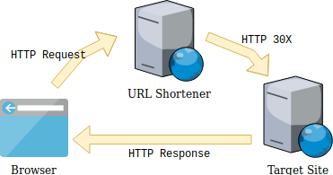
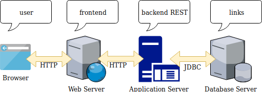

# Raccourcisseur d'URL pour l'intranet

:uk: [English version](README.md)

## A- Présentation du projet

### A.1- Objet

On constate régulièrement dans les différents sites intranet de l'entreprise (quelle qu'elle soit) l'utilisation de raccourcisseurs d'URL externes,
tels que ceux de Google ou bit.ly.

C'est un service effectivement très pratique et très populaire mais **qui n'est pas sans poser quelques problématiques**
et notamment dans une utilisation interne à l'entreprise.

### A.2- Qu'est-ce qu'un raccourcisseur d'URL ?

Un raccourcisseur ou réducteur d'URL est un générateur de liens courts, consistant à assigner une clé unique
de quelques caractères à une page web spécifique et permettant de rediriger vers l'URL d'origine.

Le protocole HTTP prévoit nativement la technique de redirection via notamment les statuts dans la plage `3XX` (généralement `301`, `302` ou `307`).

:information_source: **Un lien raccourci est donc plus facile à partager ou à mémoriser.**

A noter enfin que nombre d'applications, notamment dans le domaine des réseaux sociaux, possèdent des intégrations natives (leurs propres implémentations de réducteurs d'URL), on pourra citer par exemple YouTube, Facebook, Twitter. LinkedIn, Google.

### A.3- Les problématiques liées à l'utilisation des raccourcisseurs d'URL

* Une URL réduite offerte par un service Internet dans une utilisation interne à l'entreprise génère des flux réseaux inutiles : on sort de l'intranet pour y ré-entrer immédiatement : `intranet -> proxy web -> service internet -> firewall -> intranet`
* Une URL réduite masque l'adresse originale. Les différents services offrent généralement la possibilité de prévisualiser le site de destination au lieu d'y être redirigé directement, ... mais qui le fait vraiment ?
* Il peut exister pour une même URL autant de liens courts différents qu'il existe de services de raccourcissement.
* Si le service externe de réduction d'URL ferme alors toutes les adresses réduites l'utilisant deviennent inaccessibles, il est donc dès lors impossible d'obtenir les adresses d'origine.
* Les services externes de réduction d'URL en profitent pour collecter des données et autres statistiques.
* Une URL peut être une donnée sensible, elle peut contenir des informations importantes en paramètres (login, jeton, voire mot de passe, ...).
* Dans le cas d'une utilisation en interne on peut indirectement exposer des informations concernant l'infrastructure interne d’une entreprise.

### A.4- Constat

Il n'existe pas beaucoup d'outils sur le marché que l'on puisse installer dans le réseau de l'entreprise pour rendre ce service.

[YOURLS - Your Own URL Shortener](https://github.com/YOURLS/YOURLS) écrit en PHP en est un.

C'est tout l'intérêt de ce projet de pouvoir être déployé facilement (via des images _Docker_) et utilisé dans l'intranet d'une entreprise.

## B- Description du projet

### B.1- Architecture

Principe de redirection :

Flux entre composants :

### B.2- Détail des composants

| Composant                     | Description                                                                                                            | Technologies                              |
|-------------------------------|------------------------------------------------------------------------------------------------------------------------|-------------------------------------------|
| Frontend Web                  | Interface permettant d'enregistrer, modifier, supprimer de nouveaux liens. Rechercher ou afficher le détail d'un lien. | Vue.js + Typescript dans un serveur NGINX |
| Extension pour navigateur     | Extensions pour les navigateurs Web                                                                                    | Javascript                                |
| Backend REST                  | Exposer l'API nécessaire au frontend ainsi que la redirection effective vers l'URL ciblée.                             | Spring Boot + Liquibase + Tomcat Embedded |
| Base de données relationnelle | Stockage des éléments.                                                                                                 | H2, MySQL, MariaDB, PostGreSQL            |

### B.3 Modèle de données

#### Table 'link'

Permet le stockage des liens raccourcis.

| Colonne            | Description                                        | Type           |
|--------------------|----------------------------------------------------|----------------|
| `id`               | Identifiant interne du lien                        | `VARCHAR 15`   |
| `target_url`       | URL du lien                                        | `VARCHAR 1024` |
| `created_by`       | Nom de la personne qui a créé initialement le lien | `VARCHAR 255`  |
| `creation_date`    | Date de création initiale du lien                  | `DATETIME`     |
| `last_updated`     | Date de dernière mise à jour du lien               | `DATETIME`     |
| `is_private`       | Ce lien est-il privé ?                             | `BOOLEAN`      |
| `access_counter`   | Nombre d'accès au lien                             | `BIGINT`       |
| `creation_counter` | Nombre de tentatives de création du lien           | `BIGINT`       |

#### Table 'counter'

Permet le stockage d'un compteur de visites pour n'importe quel site.

| Column            | Description                                        | Type           |
|-------------------|----------------------------------------------------|----------------|
| `id`              | Internal ID                                        | `VARCHAR 15`   |
| `url`             | URL du lien                                        | `VARCHAR 1024` |
| `created_by`      | Nom de la personne qui a créé initialement le lien | `VARCHAR 255`  |
| `creation_date`   | Date de création initiale du lien                  | `DATETIME`     |
| `visitor_counter` | Nombre d'accès au site                             | `BIGINT`       |

#### Table 'counter_snapshot'

Permet d'historiser l'évolution du compteur.

| Colonne          | Description                                  | Type           |
|------------------|----------------------------------------------|----------------|
| `counter_id`     | ID du compteur                               | `VARCHAR 15`   |
| `claimant`       | Nom de la personne qui demande l'instantané  | `VARCHAR 255`  |
| `snapshot_date`  | Date de l'instantané                         | `DATETIME`     |
| `counter_value`  | Valeur du compteur au moment de l'instantané | `BIGINT`       |

## C- Guide d'utilisation

### C.1- Configuration

#### C.1.1- Configuration URL Shortener

Le comportement du raccourcisseur d'URL peut être configuré avec les paramètres suivants :

| Paramètre                             | Description                                                             | Contraintes                                                                        | Valeur par défaut         |
|---------------------------------------|-------------------------------------------------------------------------|------------------------------------------------------------------------------------|---------------------------|
| `urlshortener.http_redirect_status`   | Statut HTTP à utiliser pour les redirections                            | Doit être compris dans l'intervalle [300-399]                                      | `301`                     |
| `urlshortener.id_alphabet`            | Liste des caractères à utiliser pour générer un ID                      | Uniquement des caractères, séparés par une virgule. Eviter les caractères spéciaux | `0,...,9,a,...,z,A,...,Z` |
| `urlshortener.generated_id_length`    | Longueur de l'ID généré                                                 | Entier entre 2 et 10                                                               | `5`                       |
| `urlshortener.not_found_page`         | Page web statique à afficher dans le cas où l'ID fourni n'est pas connu | Une page HTML statique accessible                                                  | `static/not_found.html`   |
| `urlshortener.forbidden_ids`          | Liste d'identifiants qui ne seront pas acceptés                         |                                                                                    | `[]`                      |
| `urlshortener.provided_id_min_length` | Taille minimale pour les identifiants qui seront fournis                | Integer > 0                                                                        | `2`                       |
| `urlshortener.provided_id_max_length` | Taille maximale pour les identifiants qui seront fournis                | Integer > 0                                                                        | `115`                     |

#### C.1.2- Configuration de la base de données

La base de données utilisée doit être de type relationnelle contient les tables `link` et `count`. Les drivers suivants sont embarqués :

* H2 : `com.h2database:h2`
* MySQL : `mysql:mysql-connector-java`
* MariaDB : `org.mariadb.jdbc:mariadb-java-client`
* PostGreSQL : `org.postgresql:postgresql`

L'accès à la base de données peut être configuré via les paramètres suivants :

| Paramètre                    | Description                | Valeur par défaut |
|------------------------------|----------------------------|-------------------|
| `spring.jpa.database`        | The database type          | :no_entry_sign:   |
| `spring.datasource.url`      | The database JDBC URL      | :no_entry_sign:   |
| `spring.datasource.username` | The database username      | :no_entry_sign:   |
| `spring.datasource.password` | The database user password | :no_entry_sign:   |

#### C.1.3- Configuration LDAP

Pour une question de simplicité la sécurité est uniquement basée sur un annuaire LDAP ou AD, sans aucune gestion de rôle.

L'annuaire d'entreprise peut être configuré avec la paramètres suivants :

| Paramètre                              | Description                                                                            | Exemple                          | Valeur par défaut |
|----------------------------------------|----------------------------------------------------------------------------------------|----------------------------------|-------------------|
| `spring.ldap.urls`                     | L'URL d'accès au serveur d'annuaire                                                    | `ldap://myserver.mycompany:389/` | :no_entry_sign:   |
| `spring.ldap.base`                     | La racine de l'annuaire                                                                | `dc=mycompany,dc=org`            | :no_entry_sign:   |
| `spring.ldap.username`                 | Le nom d'utilisateur à utiliser pour se connecter                                      | `uid=ldap_reader,ou=people`      | :no_entry_sign:   |
| `spring.ldap.password`                 | Le mot de passe de l'utilisateur à utiliser pour se connecter                          | :no_entry_sign:                  | :no_entry_sign:   |
| `urlshortener.ldap_user_search_filter` | Le filtre pour la recherche des utilisateurs, relatif par rapport à la racine indiquée | `uid={0},ou=people`              | :no_entry_sign:   |

### C.2- Installation

TODO

## Annexes

### Annexe A : RFC du protocole HTTP

:bulb: [RFC HTTP Status - section-6.4.2](https://tools.ietf.org/html/rfc7231#section-6.4.2)

### Annexe B : détail des statuts HTTP de redirection

| Code  | Message                | Signification                                                                                                                                          |
|-------|------------------------|--------------------------------------------------------------------------------------------------------------------------------------------------------|
| `300` | **Multiple Choices**   | L'URI demandée se rapporte à plusieurs ressources.                                                                                                     |
| `301` | **Moved Permanently**  | Document déplacé de façon permanente.                                                                                                                  |
| `302` | **Found**              | Document déplacé de façon temporaire.                                                                                                                  |
| `303` | **See Other**          | La réponse à cette requête est ailleurs.                                                                                                               |
| `304` | **Not Modified**       | Document non modifié depuis la dernière requête.                                                                                                       |
| `305` | **Use Proxy**          | (depuis HTTP/1.1) La requête doit être ré-adressée au proxy.                                                                                           |
| `306` | **Switch Proxy**       | Code utilisé par une ancienne version de la RFC 26166, à présent réservé. Elle signifiait "Les requêtes suivantes doivent utiliser le proxy spécifié". |
| `307` | **Temporary Redirect** | La requête doit être redirigée temporairement vers l'URI spécifiée.                                                                                    |
| `308` | **Permanent Redirect** | La requête doit être redirigée définitivement vers l'URI spécifiée.                                                                                    |
| `310` | **Too many Redirects** | La requête doit être redirigée de trop nombreuses fois, ou est victime d’une boucle de redirection.                                                    |

Source : [Wikipedia](https://fr.wikipedia.org/wiki/Liste_des_codes_HTTP#3xx_-_Redirection)
